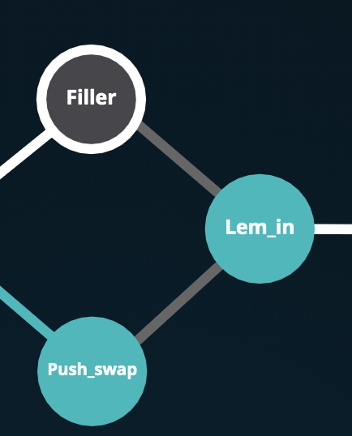
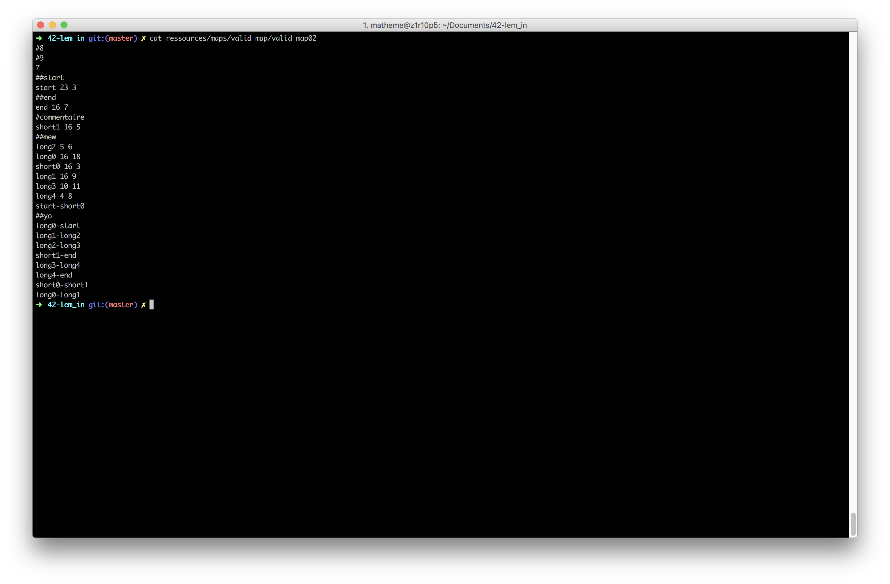
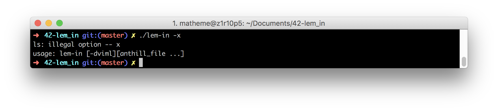
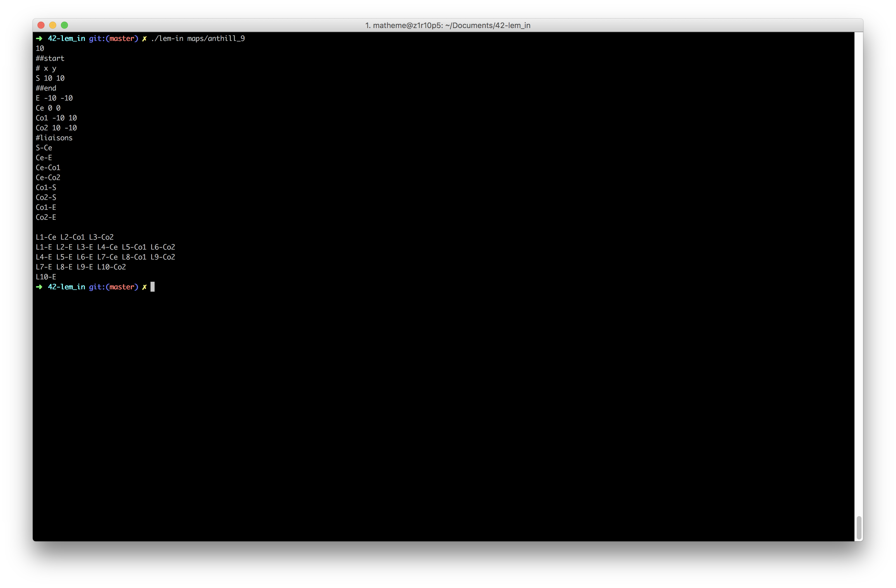

# 42 Cursus
- lem_in is the third project of the algo branch of the cursus 42
- lem_in is the project in duo. I did this project with Ocrossi (another student of 42 school)

# 42-lem_in
This project is about find a best way

Your ant colony must move from on point to another. How do you do it in the shortest time possible? This project will get you acquainted with graph traversal algorithms: your program will have to intelligently select paths and precise movements used by the ants.

For more information please read the subject in the folder ressources/subject

# Compiling and running

run the command `make` at the root of the repo then you can run lem_in with `./lem_in [anthill_maps]`
- `-m` multithreading parsing (not working)
- `-l` number of line output (for compare)
- `-v` for a little visualizer of the anthill
- `-i` for basic informations
- `-d` for advanced informations

you have a maps generator. you can run the generator with `./generator`
run `./generator --help` for the options_listing

# anthill_maps

# Program output

